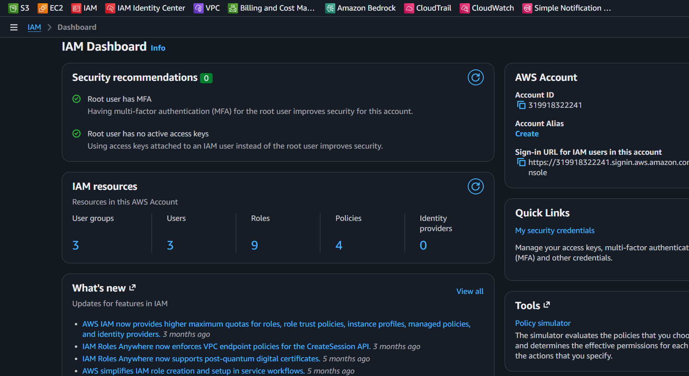
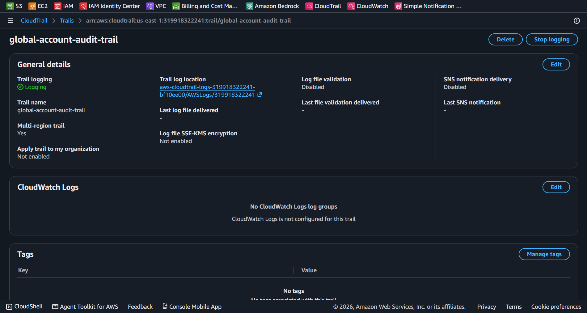
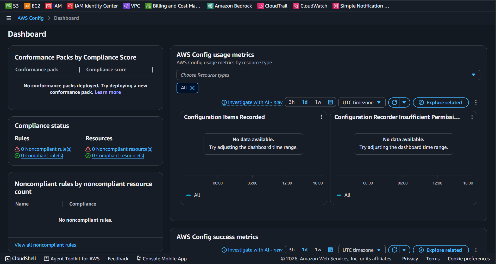

# Lab 01 - AWS Account Hardening & Security Baseline

| Informação | Valor |
|------------|-------|
| Serviço | AWS IAM, CloudTrail, AWS Config |
| Categoria | Security / Governance |
| Nível | Fundamental |
| Status | ✅ Concluído |

---

# Objetivo

Estabelecer as configurações básicas de segurança, governança e auditoria em uma nova conta AWS, garantindo conformidade, proteção de acesso privilegiado e rastreabilidade completa de eventos.

---

# Cenário

Implementação da fundação de segurança em um ambiente AWS para assegurar que a conta siga as melhores práticas recomendadas pela AWS (*AWS Well-Architected Framework*). 

As ações contemplam a proteção do acesso raiz com MFA, a centralização de auditoria de chamadas de API com o CloudTrail e a monitoração contínua do estado dos recursos com o AWS Config.

---

# Componentes configurados

## 1. Segurança de Acesso
- **Root Account & IAM:** Proteção com MFA (Multi-Factor Authentication) baseado em TOTP para evitar acessos não autorizados.

## 2. Auditoria e Governança
- **AWS CloudTrail:** Trail global para registro contínuo de eventos de gerenciamento e chamadas de API, integrado a um bucket S3 dedicado.
- **AWS Config:** Gravador contínuo habilitado para registrar e avaliar o histórico de configuração de todos os recursos suportados na conta.

---

# Evidências do laboratório

## 1. Configuração de MFA na Conta Root e IAM

Adição de uma camada extra de autenticação para proteger o acesso privilegiado à conta.

---

## 2. Ativação do AWS CloudTrail (Global Trail)

Registro contínuo de todas as chamadas de API e eventos de gerenciamento em nível global.

---

## 3. Configuração do AWS Config

Monitoramento e avaliação contínua do histórico de configuração e do status de conformidade dos recursos.

---

# Serviços utilizados

- AWS IAM
- AWS CloudTrail
- AWS Config
- Amazon S3

---

# Boas práticas aplicadas

- Proteção da conta Root com MFA.
- Centralização de logs de auditoria de API via CloudTrail global.
- Monitoramento de configuração de recursos ativado de forma contínua com o AWS Config.
- Utilização de buckets S3 dedicados para isolamento de logs e dados de governança.

---

# Conhecimentos adquiridos

- Importância da linha de base de segurança (*Security Baseline*) na AWS.
- Configuração e ativação de trilhas globais de auditoria.
- Funcionamento do monitoramento de estado de recursos por meio do AWS Config.
- Estruturação de evidências de laboratório para documentação técnica.

---

# Próximos laboratórios

- AWS Organizations & SCPs
- IAM Policies Customizadas
- Amazon GuardDuty
- AWS Security Hub

