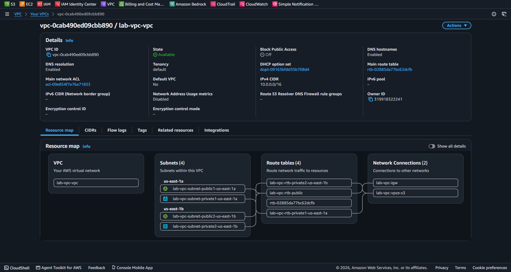

# AWS Custom VPC Infrastructure Architecture

Este repositório contém a implementação de uma rede virtual privada (**Amazon VPC**) customizada, isolada e altamente disponível para suporte a workloads em nuvem.

---

## 📌 Arquitetura da Rede

1. **Amazon VPC**: Bloco CIDR `10.0.0.0/16` segmentado para isolamento de rede.
2. **Sub-redes Públicas & Privadas**: Multi-AZ (Distributed across `us-east-1a` e `us-east-1b`) para alta disponibilidade.
3. **Internet Gateway (IGW)**: Provedor de entrada/saída de tráfego de internet para a camada pública.
4. **VPC Endpoint (S3)**: Acesso privado e direto ao Amazon S3 sem passar pela internet pública.

---

## 📸 Validação da Topologia de Rede

A imagem abaixo demonstra o mapa visual da VPC customizada e suas conexões criadas no console AWS:

---

## 💰 Análise FinOps & Boas Práticas

* **Amazon VPC, Subnets & IGW**: $0.00 / mês (Recursos de infraestrutura de rede nativos sem custo fixo).
* **VPC S3 Gateway Endpoint**: $0.00 / mês (Sem custo de endpoint para serviço S3 Gateway).
* **NAT Gateway**: **Não provisionado** neste ambiente de laboratório para evitar cobrança fixa (~$32.00/mês), mantendo a arquitetura dentro do escopo 100% gratuito.

---

> **Status:** Networking concluída com sucesso!
