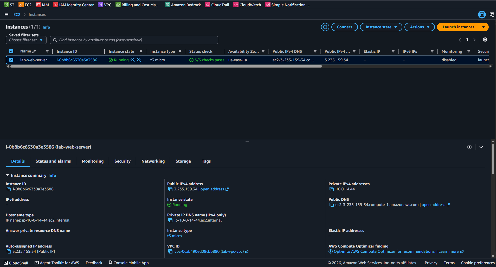
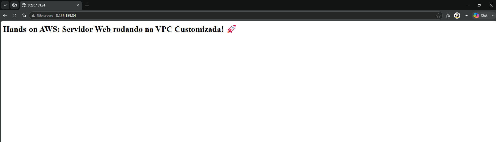

# Web Server Deployment on Custom Amazon VPC (EC2)

Este repositório contém a implementação automatizada de um servidor Web **Apache (httpd)** rodando em uma instância Linux dentro de uma infraestrutura de rede customizada (**Amazon VPC**).

---

## 📌 Arquitetura da Solução

1. **Amazon EC2**: Instância `t3.micro` rodando **Amazon Linux 2023**.
2. **User Data Bootstrap**: Automação via script Bash para atualização de pacotes, instalação e start do serviço `httpd` na inicialização da máquina.
3. **Security Groups**: Regra Inbound liberando tráfego HTTP (Porta 80) para a internet.
4. **VPC Integration**: Instância provisionada especificamente na Sub-rede Pública da VPC isolada criada anteriormente.

---

## 📸 Validação e Resultados

### Status da Instância no Console AWS

### Resposta da Aplicação Web via Navegador

---

## 💰 Análise FinOps & Custos

* **Amazon EC2 (t3.micro)**: **$0.00** (Elegível para o nível gratuito - AWS Free Tier).
* **EBS Storage (8GB gp3)**: **$0.00** (Elegível dentro da cota gratuita de 30 GB/mês).
* **Data Transfer Out**: Tráfego dentro da margem de gratuidade da AWS.

---

> **Status:** Compute concluída com sucesso!
