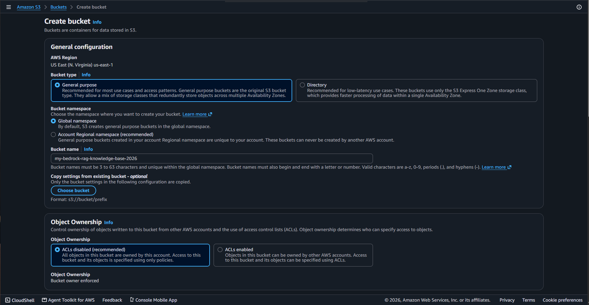
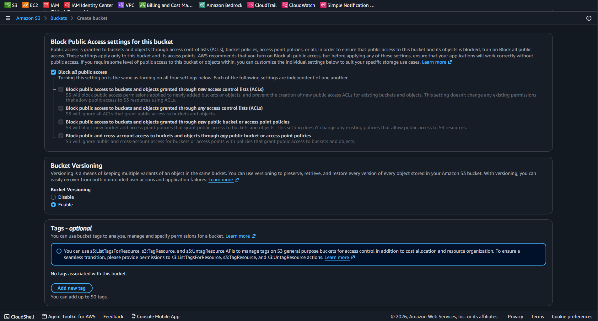
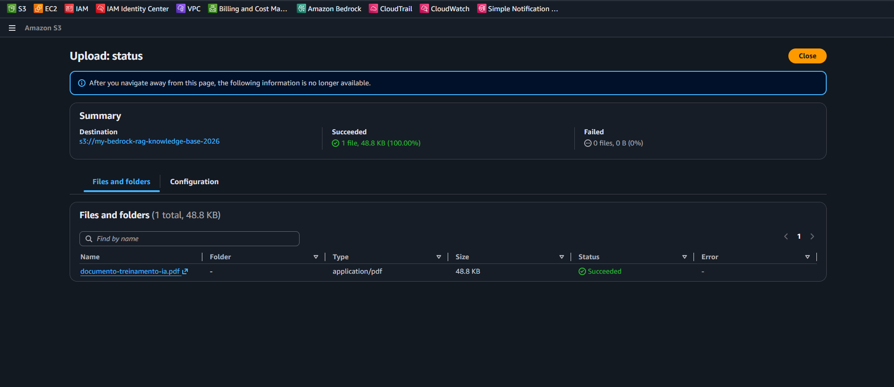

# Lab 01 - Amazon S3: Bucket Seguro e Preparação para Base de Conhecimento RAG (Bedrock)

| Informação | Valor |
| :--- | :--- |
| **Serviço** | Amazon S3 (Simple Storage Service) |
| **Categoria** | Storage / Security |
| **Nível** | Fundamental / Intermediário |
| **Certificações** | AWS Certified Cloud Practitioner (CLF-C02) / AI Certified (AIF-C01) |
| **Status** | 🟢 Concluído |

---

## Objetivo
Criar e configurar um bucket privado no Amazon S3 seguindo as melhores práticas de segurança (Bloqueio de Acesso Público e Versionamento) para servir futuramente como fonte de dados (Knowledge Base) para modelos do Amazon Bedrock (RAG).

---

## Estrutura Configurada

* **Nome do Bucket:** `my-bedrock-rag-knowledge-base-2026`
* **Região:** `us-east-1` (N. Virginia)
* **Controle de Acesso:** ACLs desativadas (propriedade total do proprietário da conta)
* **Segurança:** Block All Public Access (100% privado)
* **Resiliência:** Versionamento ativado (*Bucket Versioning*)

---

## Evidências do Laboratório

### 1. Bucket Criado na Lista do Amazon S3

### 2. Propriedades de Versionamento e Segurança

### 3. Upload do Documento de Teste para Treinamento de IA

---

## Boas Práticas Aplicadas
* **Least Privilege / Zero Trust:** Acesso totalmente privado com bloqueio público explícito.
* **Proteção Contra Sobrescrevimento:** Versionamento ativo para recuperar edições e deleções acidentais de documentos.
* **Organização para IA:** Estrutura preparada para integração nativa via IAM com o Amazon Bedrock Knowledge Bases.

---

## Conhecimentos Adquiridos
* Criação e parametrização de buckets S3 no console AWS.
* Importância do *Bucket Versioning* para integridade de dados na nuvem.
* Conceito de armazenamento de objetos utilizado em soluções de Retrieval-Augmented Generation (RAG).
