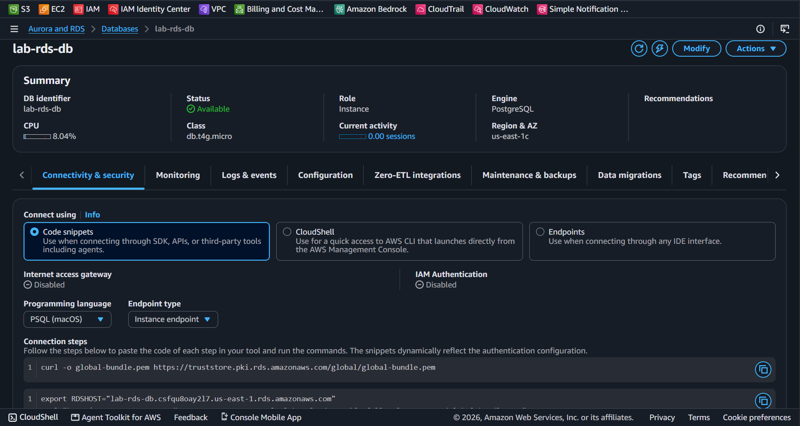

# AWS Lab 01: Provisionamento de Banco de Dados Relacional com Amazon RDS PostgreSQL

## Visão Geral

Este laboratório demonstra o provisionamento e a configuração de uma instância de banco de dados relacional **Amazon RDS PostgreSQL** em um ambiente isolado por VPC. 

A arquitetura foi configurada seguindo as boas práticas do AWS Free Tier e restringindo o acesso à rede para instâncias EC2 autorizadas.

---

## Arquitetura e Especificações Tecnológicas

* **Engine:** PostgreSQL 18.x
* **Deployment Option:** Single-AZ DB Instance Deployment (1 instância)
* **Instance Class:** `db.t4g.micro`
* **Storage:** 20 GiB General Purpose SSD (gp2)
* **Rede & Segurança:**
  * Public Access: **No** (Acesso privado apenas via VPC)
  * Security Group Inbound Rule: Porta `5432` autorizada via Security Group da instância EC2 (`sg-0a9bd5c49250fd1ea`)
  * Autenticação: Password Authentication (Self-Managed)

---

## Evidência de Implantação

Abaixo está o registro da instância RDS provisionada e em estado de operação (**Available**):

---

## Procedimento de Limpeza (Clean-up)

Após a validação do laboratório, a instância foi desprovisionada para evitar custos recorrentes e consumo do limite do Free Tier:
1. Remoção da instância sem retenção de *Final Snapshot*.
2. Exclusão das regras temporárias nos Security Groups.
