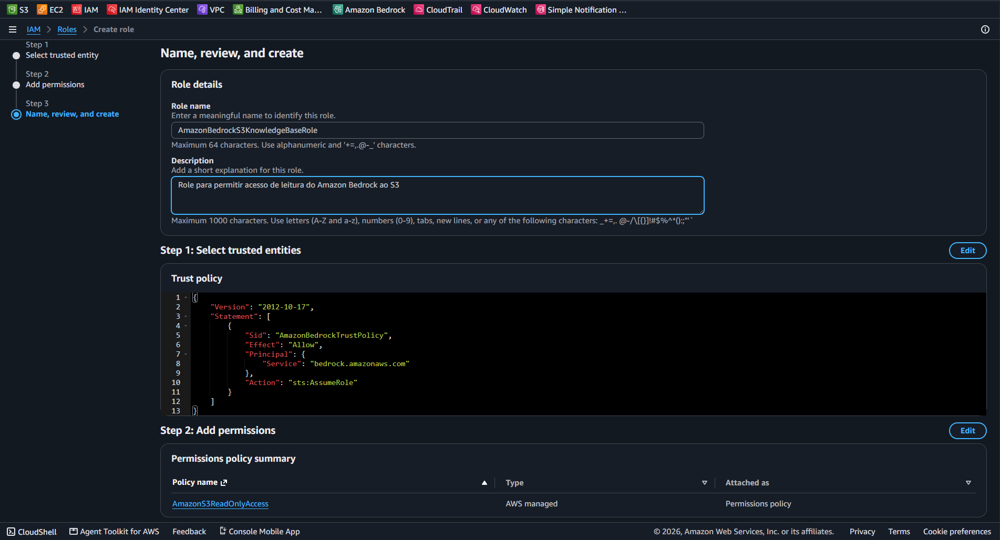

# Lab 02 - AWS IAM: Service Role e Custom Trust Policy para Amazon Bedrock

| Informação | Valor |
| :--- | :--- |
| **Serviço** | AWS IAM (Identity and Access Management) |
| **Categoria** | Security, Identity & Compliance |
| **Nível** | Intermediário |
| **Certificações** | AWS Certified Security - Specialty / AI Certified (AIF-C01) / CLF-C02 |
| **Status** | 🟢 Concluído |

---

## Objetivo
Configurar uma IAM Role de serviço (*Service Role*) com política de confiança customizada (*Custom Trust Policy*) para permitir de forma segura que o **Amazon Bedrock** acesse apenas para leitura os documentos armazenados no Amazon S3, aplicando o princípio do menor privilégio (*Least Privilege*).

---

## Estrutura Configurada

* **Nome da Role:** `AmazonBedrockS3KnowledgeBaseRole`
* **Trusted Entity (Principal):** `bedrock.amazonaws.com`
* **Permissão Concedida:** `AmazonS3ReadOnlyAccess` (AWS Managed Policy)
* **Ação de Confiança:** `sts:AssumeRole`

---

## Evidências do Laboratório

### 1. Criação da Role, Trust Policy JSON e Permissões do S3

---

## Boas Práticas Aplicadas
* **Princípio do Menor Privilégio (Least Privilege):** Concessão restrita apenas a permissões de leitura (`ReadOnly`) no armazenamento.
* **Service-Linked Security:** Autorização explícita do serviço `bedrock.amazonaws.com` via `sts:AssumeRole` sem a necessidade de criar credenciais de acesso de longa duração (*Access Keys*).
* **Segurança Reutilizável:** Role pronta para integração nativa com o Amazon Bedrock Knowledge Bases / RAG.

---

## Conhecimentos Adquiridos
* Diferença entre acessos para usuários humanos e *Service Roles* para recursos/serviços AWS.
* Escrita e interpretação de *Trust Policies* em formato JSON.
* Governança de acesso entre serviços de IA (Bedrock) e de armazenamento (S3).
