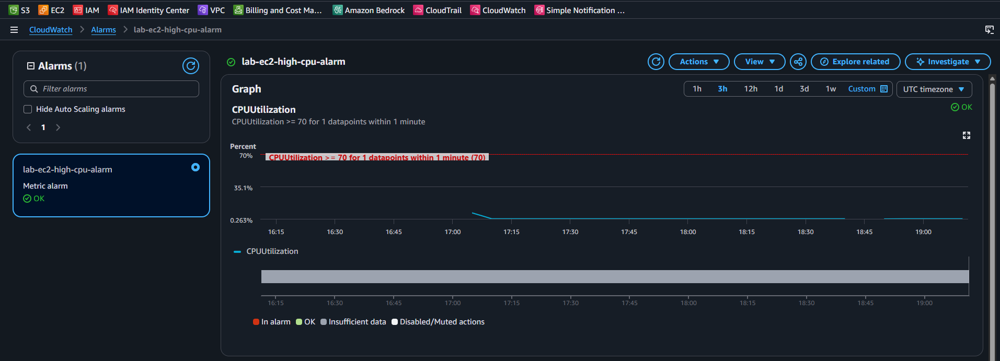
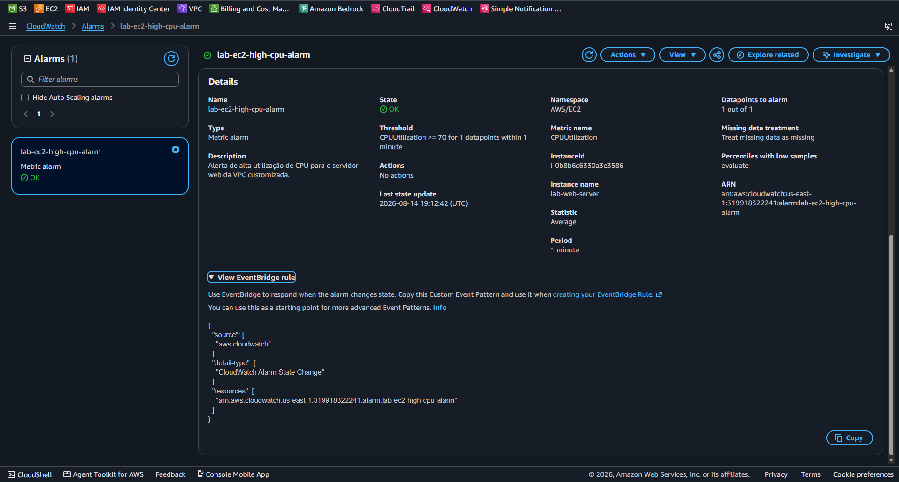

# EC2 CPU Monitoring & CloudWatch Alarm

Este laboratório demonstra a implementação de observabilidade e monitoramento contínuo em instâncias Amazon EC2 utilizando o **Amazon CloudWatch**.

---

## 📌 Arquitetura e Configurações

1. **Métrica Monitorada**: `CPUUtilization` da instância `lab-web-server`.
2. **Threshold (Limiar)**: Maior ou igual a **70%** de consumo de CPU (`>= 70`).
3. **Janela de Avaliação**: Avaliação a cada período de **1 minuto**.
4. **Resolução**: Métricas coletadas em tempo real via namespace nativo `AWS/EC2`.

---

## 📸 Validação e Evidências

### Gráfico e Linha de Limite do Alarme

### Detalhes da Configuração do Alarme

---

## 💰 Análise FinOps & Custos

* **Amazon CloudWatch**: **$0.00** (Incluído no nível gratuito da AWS, que permite até 10 alarmes de métricas personalizadas/padrão por mês sem custo).

---

> **Status:** Missão 4 (Monitoring) e Meta Diária concluídas com sucesso! 🚀
