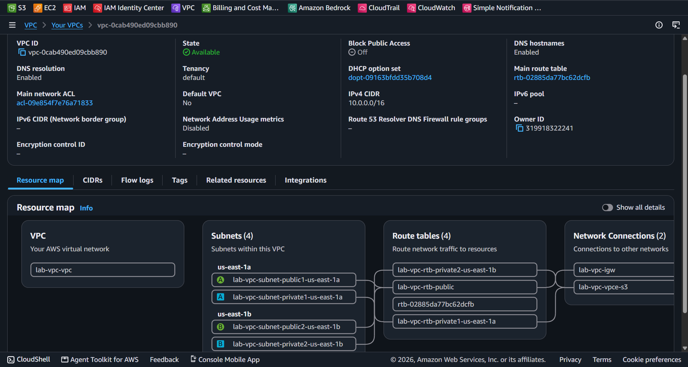
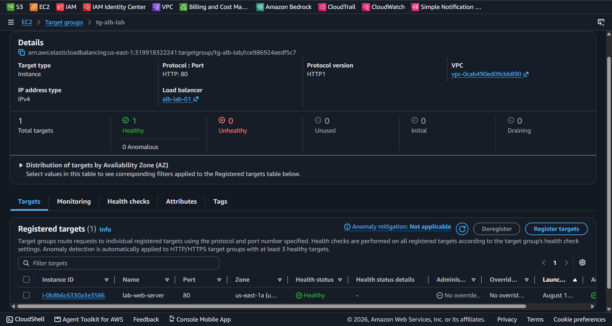
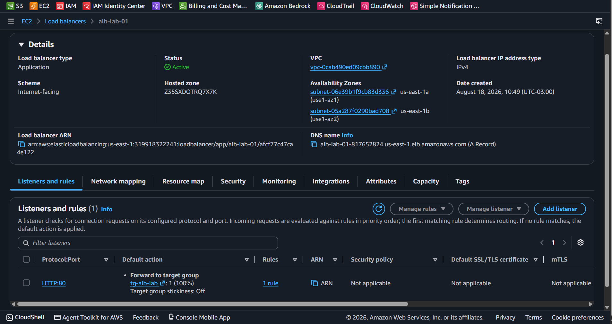
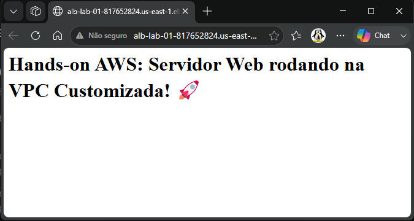

# Arquitetura de Alta Disponibilidade na AWS: Application Load Balancer (ALB) e VPC Multi-AZ

Este projeto demonstra a implementação de uma arquitetura de alta disponibilidade e resiliência na AWS, utilizando um **Application Load Balancer (ALB)** para distribuir o tráfego HTTP entre instâncias EC2 implantadas em múltiplas Zonas de Disponibilidade (AZs) dentro de uma VPC customizada.

---

## 📐 Arquitetura da Solução

* **Amazon VPC:** Rede isolada com subnets públicas e privadas distribuídas entre `us-east-1a` e `us-east-1b`.
* **Application Load Balancer (ALB):** Ponto de entrada público (`Internet-facing`) na porta 80 (HTTP) cobrindo múltiplas AZs.
* **Target Group:** Agrupamento das instâncias backend com verificação contínua de integridade (*Health Checks*).
* **Security Groups:** 
  * `alb-sg`: Permite tráfego de entrada HTTP (80) vindo de qualquer origem da internet (`0.0.0.0/0`).
  * `ec2-sg`: Permite tráfego HTTP (80) derivado exclusivamente do Security Group do Load Balancer.

---

## 📸 Evidências de Implantação

### 1. Mapeamento da VPC e Subnets
Resource map mostrando as subnets distribuídas em múltiplas AZs e tabelas de roteamento conectadas ao Internet Gateway.

### 2. Target Group e Health Checks
Instâncias devidamente registradas e respondendo com status **Healthy** aos testes de integridade do ALB.

### 3. Application Load Balancer Ativo
Provisionamento e status operacional **Active** do ALB no console AWS.

### 4. Validação de Acesso End-to-End
Acesso público ao servidor web via DNS do Load Balancer na porta 80 HTTP.

---

## 🛠️ Aprendizados e Conceitos Aplicados

* Configuração e roteamento de Camada 7 (HTTP) utilizando Application Load Balancer.
* Isolamento de redes e distribuição de cargas em múltiplos domínios de falha (Multi-AZ).
* Encadeamento de Security Groups para restrição do acesso direto às instâncias backend.
