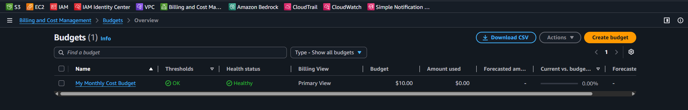
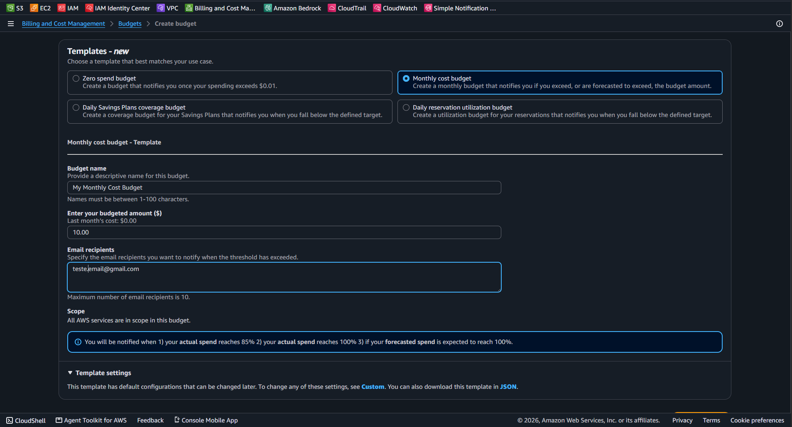

# Lab 01 - AWS Budgets e Cost Explorer: Gestão Financeira e Alertas

| Informação | Valor |
| :--- | :--- |
| **Serviço** | AWS Budgets / AWS Cost Explorer |
| **Categoria** | Cost Management & Governance |
| **Nível** | Fundamental |
| **Certificações** | AWS Certified Cloud Practitioner (CLF-C02) |
| **Status** | 🟢 Concluído |

---

## Objetivo
Configurar o monitoramento proativo de custos e limites de faturamento na AWS utilizando o AWS Budgets, garantindo alertas automatizados via e-mail e ativando o Cost Explorer para análise de gastos.

---

## Estrutura Configurada

* **AWS Budget Criado:** Alerta de Custo Zero / Limite Mensal
* **Gatilho de Notificação:** Envio de e-mail ao atingir 80% do valor orçado
* **Cost Explorer:** Preferências de faturamento e relatórios de custo ativados

---

## Evidências do Laboratório

### 1. Configuração do Orçamento no AWS Budgets

### 2. Ativação do Cost Explorer e Preferências

---

## Boas Práticas Aplicadas
* **Governança Financeira:** Prevenção de cobranças indesejadas durante o uso do Free Tier / Créditos.
* **Monitoramento Proativo:** Alertas automáticos antes do esgotamento do orçamento.

---

## Conhecimentos Adquiridos
* Diferença entre AWS Budgets (alertas) e AWS Cost Explorer (análise e previsão).
* Configuração de notificações de custo por e-mail.
* Conceitos fundamentais do pilar de Gestão de Custos cobrados na certificação CLF-C02.
