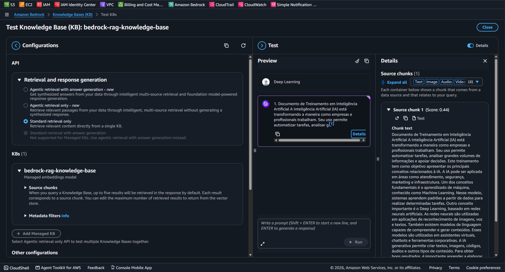

# AWS Bedrock Knowledge Base (RAG) Infrastructure

Este repositório contém a implementação de um pipeline de Retrieval-Augmented Generation (RAG) utilizando o **Amazon Bedrock Knowledge Bases**, **Amazon S3** e banco de dados vetorial gerenciado.

---

## 📌 Arquitetura do Laboratório

1. **Amazon S3 Bucket**: Armazenamento do corpus documental (documentos de treinamento em IA/ML).
2. **AWS Bedrock Knowledge Base**: Motor de vetorização (Embeddings) e indexação dos documentos.
3. **OpenSearch Serverless / Vector Store**: Armazenamento dos vetores para busca por similaridade semântica.
4. **Retrieval API**: Interface de consulta e recuperação de chunks com base no contexto informado pelo usuário.

---

## 📸 Validação e Teste de Sincronização

A imagem abaixo demonstra a consulta via **Standard Retrieval Only**, onde a Knowledge Base recupera os trechos relevantes do documento armazenado no S3 a partir do termo de pesquisa `Deep Learning`:

---

## 💰 Análise FinOps & Boas Práticas

* **Amazon S3**: Custo negligível para armazenamento de arquivos base de texto ($0.023/GB/mês).
* **Bedrock Knowledge Base (Retrieval)**: Cobrança por milhão de tokens processados na vetorização e recuperação.
* **Model Inference (Converse API)**: Requer alocação de cota (`Service Quotas`) para geração de respostas sintetizadas por LLMs em produção (ex: Anthropic Claude ou Amazon Nova).

---

> **Status:** Laboratório concluído e validado com sucesso!
