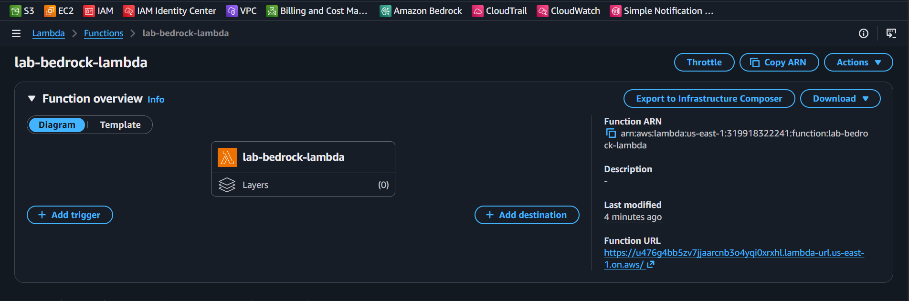
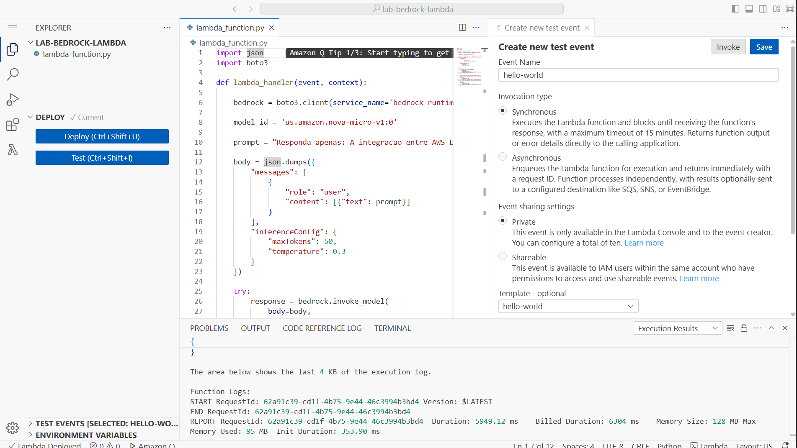
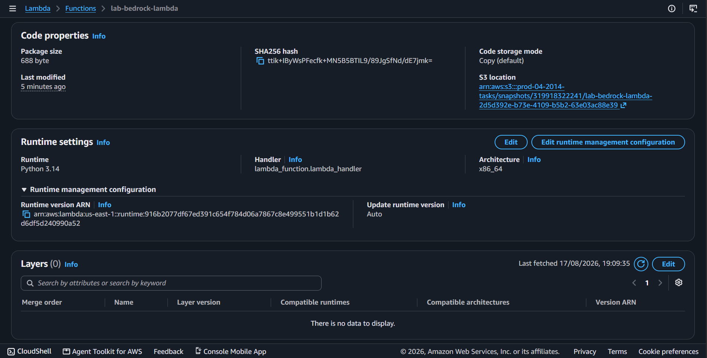

# Lab 03: Serverless AI Integration with AWS Lambda & Amazon Bedrock

## 📌 Visão Geral
Este laboratório demonstra a integração serverless entre uma função **AWS Lambda** em **Python 3.14** e o **Amazon Bedrock**, utilizando o SDK `boto3` para invocar modelos de linguagem generativa (Amazon Nova Micro) através de chamadas de API.

## 🏗️ Arquitetura do Projeto
- **Compute:** AWS Lambda (`lab-bedrock-lambda`) em Python 3.14 (x86_64).
- **AI/ML Service:** Amazon Bedrock Runtime (Inference Profile: `us.amazon.nova-micro-v1:0`).
- **Security:** AWS IAM Execution Role com políticas de acesso de privilégio mínimo para a chamada `bedrock:InvokeModel`.

## 🔍 Validação e Observações Técnicas

Durante os testes de invocação do Lambda, a integração com o Amazon Bedrock foi validada com sucesso no nível de comunicação e autenticação IAM.

> **Nota de Arquitetura:** O retorno do teste exibiu a exceção `ThrottlingException: Too many tokens per day`. Isso confirma que a função Lambda autenticou e alcançou o endpoint do Bedrock corretamente. O bloqueio ocorre devido às travas padrão de segurança e cotas diárias de tokens (*Service Quotas*) aplicadas pela AWS para evitar consumo acidental em ambientes de teste.

## 🖼️ Evidências da Infraestrutura

